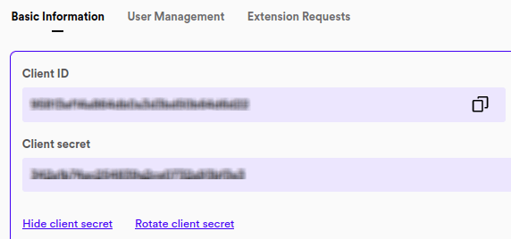
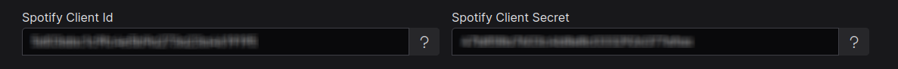
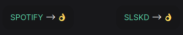

== About SoulSync

Segunda versión del bot SoulSync. SoulSync es un bot para automatizar la busqueda de playlists de Spotify en la red de SoulSeek haciendo peticiones a la API de link:https://github.com/slskd/slskd[SLSKD]

Puedes probar el bot desde el siguente enlace, algunas funcionaldiades están limitadas.

* *Versión demo*
** Credenciales: *user*: demo / *password*: demo
** Demo deploy: https://soulsync.fyi

== Estado del desarrollo

El bot continua en desarrollo, hay funcionalidades que faltan por añadir (Youtube, Archivos CSV o TXT, preescucha, responsive...) y otras por mejorar. Hay algunos bugs de los cuales soy consciente, pero voy ajustado de tiempo... Así que puedo ponerme a ello cuando tengo tiempo libre y ganas.

Si quieres hacer alguna peticion o quieres colaborar con el desarrollo puedes ponerte en contacto desde el formulario de contacto de mi site personal. link:https://xavi.tech/#contact[*Formulario de contacto*]

=== Novedades v2

* *Se ha mejorado considerablemente el código relacionado con la cola de busquedas pendientes*, evitando que pasado el tiempo la aplicación desbore el uso de memoria RAM.

* *Se ha mejorado la interfaz de usuario*, incluida una fase inicial de configuración en el primer arranque.

* *Se permiten distintas configuraciones de busqueda/descarga por playlist*, además de mas de una lista de descarga por playlist.

* Otras mejoras de codigo y funcionamiento.

== Requisitos

* *SLSKD* - Es necesaria una instancia de SLSKD corriendo a la que puedas realizar peticiones. (link:https://github.com/slskd/slskd?tab=readme-ov-file#quick-start[Slskd Quick Start])
** *IMPORTANTE*: Si no has usado nunca SLSKD, no solo tienes que iniciar la instancia, tienes también que configurar tu usuario y directorios o el bot no funcionará.

* *SPOTIFY* - Una cuenta (free o premium) de Spotify. Es necesaria para crear las credenciales de API para configurar el bot. (link:https://developer.spotify.com/[Spotify Developer])

* *DOCKER o JAVA* - Es necesario Docker con compose o Java, según como pretendas correr el bot. Igual la forma mas sencilla de hacerlo es mediante Docker.

== Instalación

El primer paso es clonar el repositorio:

----
git clone https://github.com/xaviqo/SoulSyncBot.git
----

Y ahora decide como quieres proceder:

=== Si prefieres usar Docker...

. Configurar volumenes (necesario si vas a usar la funcionalidad _relocate_)

Si quieres que las descagas finalizadas se copien en un directorio concreto deberás configurar la seccion _volumes_

----
    volumes:
      - /slskd/local/downloads/directory:/soulsync/slskd-downloads
      - ../soulsync/local/relocated/directory:/soulsync/relocated
----

=== Si prefieres usar Java...

*Seccion pendiente de completar*

Para ejecutar la aplicación de forma nativa es necesario:

* Tener Java instalado (21). Puedes usar SDKMAN para este aspecto.

* Tener PostgreSQL instalado y crear la DB.

* (Recomendado) - Puedes usar _nohup_ para ejecutar detached el bot.

Debes configurar la DB en el application.yml.

* Compilamos la aplicacion con:

----
mvn clean package
----

* Ejecutamos el _jar_ creado en el directorio _/target_. Debes cambiar la version por la actual. Puedes verlo en la seccion releases o aun mas facil, hacer _ls_ en el directorio _target_. (p.e. )

----
java -jar backend/target/soulsync-backend-{version}.jar
----

== Setup

* Accede a la aplicación y pulsa siguente para introducir las variables de configuracion. (http://localhost:6743/)

=== Credenciales de Spotify

* Inicia sesion en el panel de desarrolladores de Spotify (https://developer.spotify.com/dashboard)

* Crea una aplicación nueva pulsando sobre *Create App*

* Añade un _Nombre de la App_ (por ejemplo, «soulsync»), una _Descripción de la App_ (por ejemplo, «description») y un _Redirect URI_. (por ejemplo, «https://google.com»). *Puedes poner lo que quieras, sólo necesitamos las claves API*

* Una vez creada, ve al panel de la app creada pinchando sobre ella y pulsa el botón *Settings* de la parte superior derecha.

* Copiamos las credenciales proporcionadas y las introducimos en l (Client id/Client secret)

=== Credenciales de Slskd

* Indica la direccion de acceso de Slskd. Es la misma que usas para acceder como usuario (http://localhost:5030)

* Introduce tu usuario y contraseña. Por defecto es *slskd* como usuario y contraseña.

=== Probar conexión

* Tan sencillo como pulsar sobre *Check Connection*. Cuando ambos indicadores están en verde, puedes comenzar a usar el bot. Como ultimo paso puedes cambiar las credenciales si lo deseas.

=== Configuración general

==== Políticas de busqueda

== Agradecimientos y documentacion de interés

* link:https://github.com/slskd/slskd[*Slskd Repository*] - *My gratitude towards this project is absolute*. Not only because I have been using their application for a long time, but also because their API has been fundamental for the development of the bot.

* link:https://www.reddit.com/r/Soulseek[*SoulSeek Reddit*] - Subreddit for P2P file-sharing client Soulseek

* link:https://www.youtube.com/watch?v=c-TZKCsOWDw[*The other truth about PIRACY* (Spanish)] - Analysis on piracy, by a renowned communicator of the spanish-speaking musical universe

* link:https://xavi.tech[*My Personal Portfolio*] - Contact page and other projects

== Final notes

This is the first time I have made an application of this type. I have learned a lot during the development and there are things that I would now change, as well as ideas that I have not yet fully implemented. Therefore, I plan to make a new version of the application this year, with more features that will surely be liked.