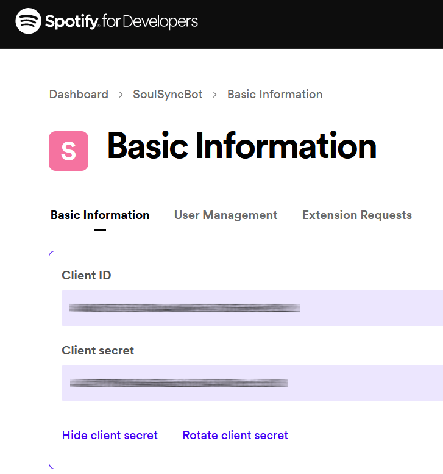
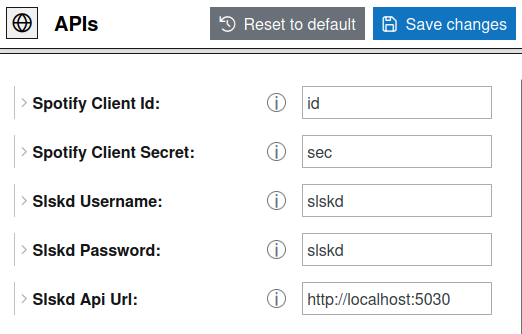
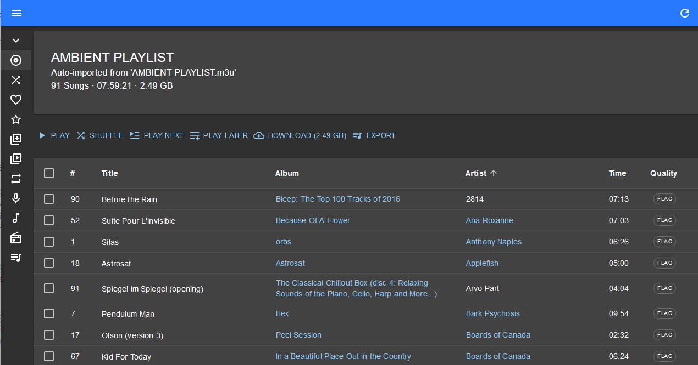

image::README/logo.png[align=center]

== Description

*SoulSync* is a bot to automate downloading music from the SoulSeek network. It leverages link:https://developer.spotify.com/documentation/web-api[Spotify API] and link:https://github.com/slskd/slskd[Slskd API] to manage downloads.

The development has been done with _SpringBoot_ for the backend and _VueJS_ for the frontend.

*Please note that _SoulSync_ is currently under development*. If you have any questions or want to collaborate, feel free to link me at https://xavi.tech#contact[contact me] or through this repository.

== Requirements

* *SLDKD*: You need to have an instance of SLSKD running (link:https://github.com/slskd/slskd?tab=readme-ov-file#quick-start[Slskd Quick Start]) on your machine, Raspberry Pi, or VPS.

* *Spotify account (free or premium)*: Needed to create an API KEY/SECRET API.

* *Docker*: You must have docker installed (https://docs.docker.com/engine/install/) as well as Docker Compose (https://docs.docker.com/compose/install/).

====
*If you have understood these requirements, you may continue :)*.
====

== Installation with Docker

* Clone the repository

----
git clone https://github.com/xaviqo/SoulSyncBot.git
----

* Navigate to DOCKER directory

----
cd SoulSyncBot/DOCKER
----

* Build the docker images* (we will use --no-cache to make sure we build them from scratch)

_* It may take several minutes to start, as it has to download all the dependencies, compile and start the_ services.

----
docker-compose build --no-cache
----

* Start the services

----
docker-compose up
----

== Minimum configuration required to operate

====
*The default credentials are: admin/admin*. You can change them in the same panel once you are logged in.
====

* Log in to the bot:

http://localhost:7316/ (credentials: admin/admin).

* Check that you have response from Slskd and Spotify:

.The 4 buttons should be green as shown in the image
image::README/api-status.png[]

* Log in to the Spotify Developer dashboard. You can log in with your personal Spotify account: https://developer.spotify.com/dashboard

* Create an APP from the control panel by clicking the *Create App* button.

* Add an _App Name_ (e.g. "soulsync"), an _App Description_ (e.g. "description") and a _Redirect URI_. (e.g. "https://google.com"). *You can put whatever you want, we just need the API keys.

* Once created, go to the panel of the created app by clicking on it and press the *Settings* button at the top right.

* Copy API credentials

* Paste them into the fields and save

* Change also the Slskd URL and credentials if necessary (if you don't run it on your machine or you are not using the default user/password)

== Features

* *File format settings* - Configure from the application panel the desired file format for your downloads (FLAC/MP3/OGG/AIFF...)

* *Detecting Spotify playlist updates* - The bot will detect new additions to your spotify playlists and add them to the download queue

* *Full synchronization with Navidrome or similar* - With the functionality to move downloaded files, you can organize your music by playlists or artist/disc with Navidrome or similar applications. To fully automate the process you can use my link:https://github.com/xaviqo/create-m3u-by-folders-bash[Bash script that generates playlists automatically].

.Playlists from my personal Spotify on Navidrome. Obtained with the bot

== Acknowledgements and links of interest

* link:https://github.com/slskd/slskd[*Slskd Repository*] - *My gratitude towards this project is absolute*. Not only because I have been using their application for a long time, but also because their API has been fundamental for the development of the bot.

* link:https://developer.spotify.com/documentation/web-api[*SoulSeek Reddit*] - Subreddit for P2P file-sharing client Soulseek

* link:https://www.youtube.com/watch?v=c-TZKCsOWDw[*The other truth about PIRACY* (Spanish)] - Analysis on piracy, by a renowned communicator of the Spanish-speaking musical universe

* link:https://xavi.tech[*My Personal Portfolio*] - Contact page and other projects

== Final notes

This is the first time I have made an application of this type. I have learned a lot during the development and there are things that I would now change, as well as ideas that I have not yet fully implemented. Therefore, I plan to make a new version of the application this year, with more features that will surely be liked.

*I appreciate any comments, criticism or constructive advice.*

== Captures

.SoulSync home page
image::README/main.png[]

.Table with playlist tracking information
image::README/songtable.png[]