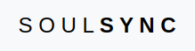
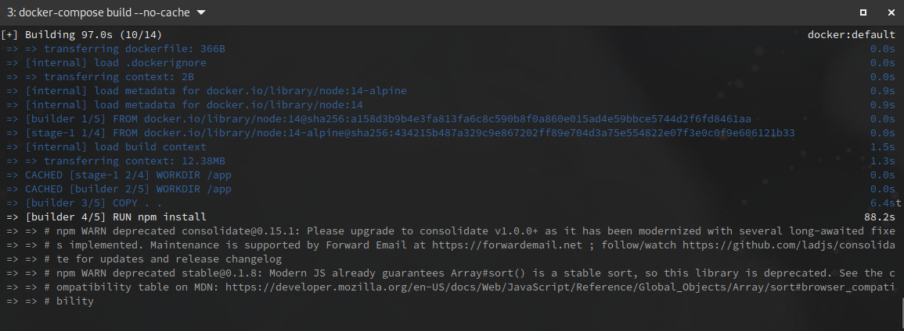

== Description

*SoulSync* is a bot to automate the downloading of music from the SoulSeek network. It uses the link:https://developer.spotify.com/documentation/web-api[Spotify] and link:https://github.com/slskd/slskd[Slskd] APIs to manage downloads.

The development is being done with SpringBoot for the backend and VueJS for the frontend, since they are the two technologies that I handle better. If you have any questions about how to set it up, please contact me.

*This bot is still under development*, although it is already a bit unstable. If you have any questions or would like to collaborate, don't hesitate to link:https://xavi.tech[contact me] via email or through this repository.

== Installation

====
This guide is focused on the installation on a Linux system, on other OS some steps may differ.
====

In order to run the bot correctly, you must first have an instance of Slskd running locally or on another remote machine.

In the official Slskd repository you will get all the necessary information: https://github.com/slskd/slskd

=== Install using Docker

In order to install with docker, make sure you have Docker installed on your OS (https://docs.docker.com/engine/install/) and also Docker Compose (https://docs.docker.com/compose/install/)

If you already have Docker and Slskd up and running, we can continue:

==== Clone this repo on your machine

----
git clone https://github.com/xaviqo/SoulSyncBot.git
----

==== Move to the DOCKER directory

----
cd SoulSyncBot/DOCKER
----

==== Customize the YAML file if needed

You can adapt some points of this file to your needs, for a deeper configuration of the application, you will have to do it from the properties and yaml files of the Java API or from the control panel once the bot has started.

- *Services*
* Database - *db*: You can change the port and authentication credentials to your preference, but you must also change them in the service configuration below (be).
* Backend - *be*: API listening port and Postgres connection data. If you modify the API listening port, you must create an .env file with the environment variable _VUE_APP_BACKEND_URL_ and the value of the selected port.
* Frontend - *fe*: Express server listening port for the frontend.

==== Build and compose

Finally, we will build the docker images (we use --no-cache to ensure that we build them from 0):
----
docker-compose build --no-cache
----

And we will start the services:
----
docker-compose up
----

====
*Attention!* It may take several minutes to start, as it has to download all the dependencies, compile and start the services.
====

Once started, we can visit our frontend (http://localhost:7316/) where we will be able to add from the control panel, the Spotify API keys and the Slskd URL to where we will send the search and download requests.

=== Standard installation

_Section in progress_

== Configuration

=== Spotify API keys

=== Slskd API URL

=== Control Panel

=== SpringBoot

=== VueJS

=== Logs

== Features

== Acknowledgments

Soulseek community and Slskd

== Captures

.SoulSync home page
image::README/main.png[]

.Table with playlist tracking information
image::README/songtable.png[]