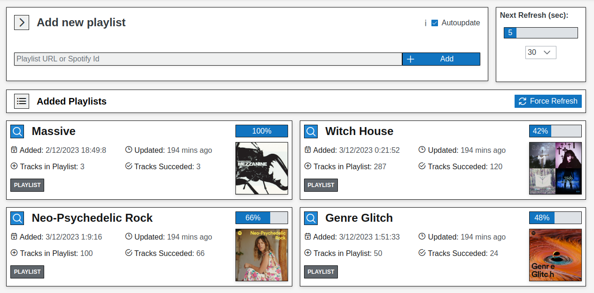
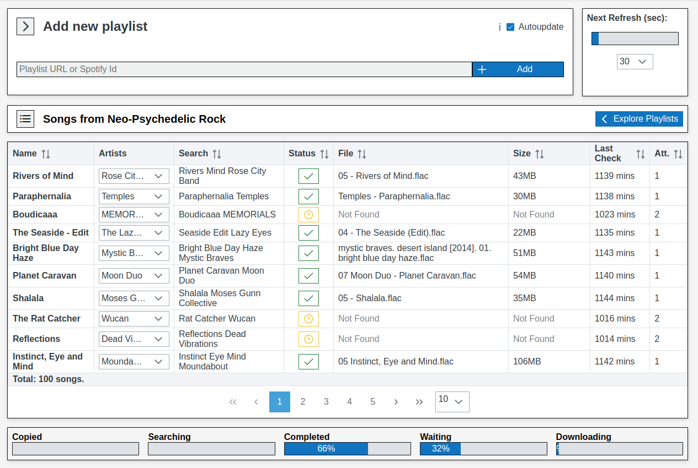

= SoulSync BOT

== Description

SoulSync is a bot to automate the downloading of music from the SoulSeek network. It uses the Spotify and Slskd APIs to manage downloads.

The development is being done with SpringBoot for the backend and VueJS for the frontend, since they are the two technologies that I handle better. Although I am working on automating the deployment with docker, the file is not ready yet. If you have any questions about how to set it up, please contact me.

Note that the bot is still under development, although it is already usable. If you have any questions or collaboration, don't hesitate to contact me a traves de mi portfolio.

== Captures

.SoulSync home page

.Table with playlist tracking information
